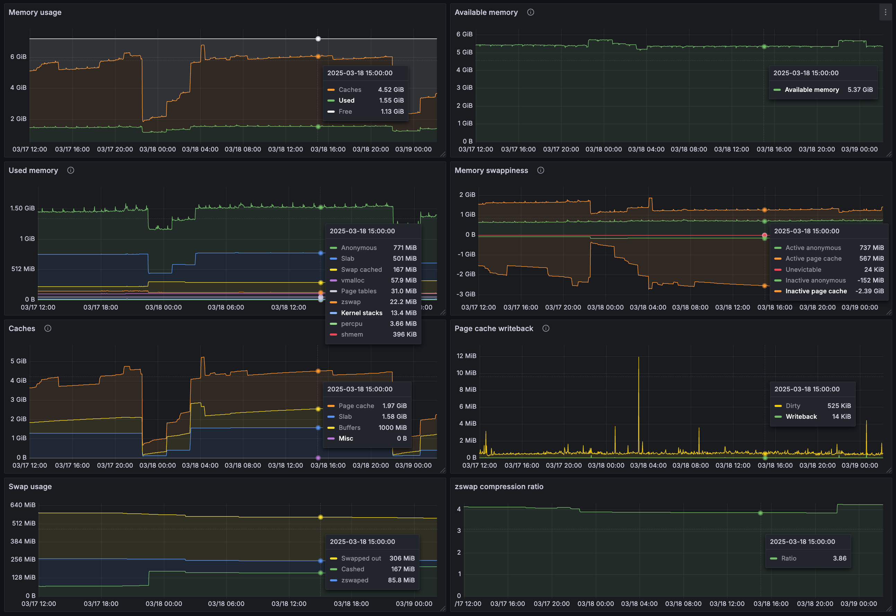

Сколько себя помню, меня всегда привлекали счётчики памяти в Linux: смотришь в условный `htop` – в плане потребления CPU вроде всё +/- понятно, а вот память всегда считалась как-то не так, как ты это на первый взгляд ожидаешь, и долгое время у меня было довольно наивное и ошибочное представление о механизмах её работы.

Со временем, некоторые вещи прояснялись, приходило понимание, как именно оно работает под капотом (до определённой степени). В какой-то момент возникла рабочая необходимость понять, куда уходит память на реальной системе – и этот случай в очередной раз показал, что местами оно устроено довольно неочевидно, и на этот вопрос не всегда просто дать ответ. Ну а помимо рабочей необходимости у меня дома давно стоит сервер, обвешанный метриками, и всегда хотелось высветить себе их в понятной форме, чтобы потом в реальном времени наблюдать, как ведёт себя система, когда в ней происходят какие-то процессы.

В этой статье я попробую разобрать, как сделать такой мониторинг и как интерпретировать его результаты. Сразу оговорюсь, что никогда не занимался разработкой ядра – вся информация ниже исключительно из личного опыта, поверхностного чтения исходников ядра и обильного гугления. Поэтому не исключено, что где-то могу быть неточным или вовсе неправым, но будем надеяться, что не сильно.

## Ликбез по организации памяти в Linux

Смотреть на счётчики ядра без понимания того, что именно они измеряют, нет никакого смысла – поэтому начнём с описания базовых принципов того, как оно вообще работает под капотом (упрощая – иначе нужно писать не статью, а целую книгу).

### Free-память

Пожалуй первое, о чём стоит упомянуть – так это о том, что если вы посмотрите на систему, которая проработала какое-то ненулевое количество времени, то у неё, как правило, будет очень маленькое количество free-памяти. И это полностью нормально, т. к. под free-памятью Linux понимает именно память, которая полностью свободна, и в ней ничего не хранится. Но это слишком ценный ресурс, чтобы просто так простаивать без дела – поэтому Linux всегда пытается использовать всю свободную память с пользой и занять её какими-нибудь кэшами, которые будут ускорять работу системы, но при необходимости всегда могут быть быстро освобождены. Поэтому, как правило, на большинстве систем всю свободную память занимает page cache.

### Page cache

Если вы напишете программу, которая записывает в файл какие-то данные, а затем эта (или даже другая) программа будет его читать, то можно заметить интересную особенность: даже если файл очень большой (гигабайты), но меньше объёма свободной памяти, то и операции записи, и операции чтения из файла будут происходить очень быстро – гораздо быстрее, чем может работать диск под ними.

Всё дело в том, что когда программа пишет данные на диск (выполняет системный вызов [write(2)](https://man7.org/linux/man-pages/man2/write.2.html)), работа этого системного вызова как правило заключается в том, что он просто записывает данные в память – и сразу же возвращает управление. И уже только потом (асинхронно) ядро записывает эти данные на диск. При этом после записи данные как правило продолжают оставаться в памяти, и последующий вызов [read(2)](https://man7.org/linux/man-pages/man2/read.2.html) на том же файле сможет считать их оттуда моментально, совершенно не обращаясь к диску.

Данная подсистема ядра называется page cache, и смысл её работы (упрощённо) следующий: при работе с любым блочным устройством все (если специально не попросить обратного – см `O_DIRECT` в [open(2)](https://man7.org/linux/man-pages/man2/open.2.html))  операции чтения и записи происходят через page cache. Если ядру необходимо считать какую-то информацию с диска, то оно считывает её в page cache страницами по 4 KiB, и уже затем доступ к данным происходит через него. При записи также сначала информация попадает в page cache, и только потом асинхронно сбрасывается на диск (если не попросить это сделать досрочно через вызов [fsync(2)](https://man7.org/linux/man-pages/man2/fsync.2.html)). Это приводит к интересной особенности – в общем случае, когда нет memory pressure (о нём поговорим ниже), запись всегда происходит мгновенно (т. к. мы по сути пишем в память, а не на диск), а вот чтение может быть долгим (если файл ещё не закэширован в page cache).

Вообще, page cache – это невероятно универсальный и крутой механизм, который используется практически повсюду. К примеру:
1. С помощью него можно за-[mmap(2)](https://man7.org/linux/man-pages/man2/mmap.2.html)'ить файл в память и работать с ним так, как будто вы работаете с обычной памятью. При этом ОС автоматом будет подгружать данные, когда вы обращаетесь к конкретному участку памяти и даже больше – ещё до того, как попытаетесь обратиться – за счёт механизмов prefetching.
2. Знаете ли вы, как программы загружаются на исполнение? Наивный (и на первый взгляд логичный) ответ звучал бы так, что ядро выделяет блок памяти и считывает туда бинарь с диска, а затем передает управление на исполнение. Но на самом деле всё устроено гораздо интереснее: когда вы запускаете какое-либо приложение (или даже несколько его экземпляров), Linux по сути просто [mmap(2)](https://man7.org/linux/man-pages/man2/mmap.2.html)'ит бинарник в память процесса – и передаёт управление на нужную инструкцию, а дальше уже по мере того, как процессор прыгает по этим инструкциям, подгружает данные в page cache и отдаёт оттуда. Поэтому даже очень толстые бинари потребляют небольшое количество памяти, если по факту исполняется только небольшая часть их кода. Правда, есть и другой side effect: в случае memory pressure (см. ниже) система может сбросить page cache загруженных бинарей, и даже если у вас в системе нет swap-файла, у вас будут точно такие же задержки, как и в случае, когда ОС выгрузила ваши данные на диск.

Очень рекомендую почитать [Linux Page Cache for SRE](https://biriukov.dev/docs/page-cache/0-linux-page-cache-for-sre/) для более глубокого погружения в тему.

### Buffers

Вот этот счётчик, на удивление, является самым запутанным по сравнению со всеми остальными. Вся информация, которая сходу гуглится по нему, довольно противоречивая, а в документации и вовсе написано "Relatively temporary storage for raw disk blocks shouldn't get tremendously large (20MB or so)" – при том, что я регулярно вижу как он показывает гигабайты.

Но на самом деле всё довольно просто: в ранних версиях Linux ту работу, которую сейчас выполняет подсистема Page Cache, выполняли две отдельные подсистемы. Теперь это уже не так, но в `/proc/meminfo` сохранено старое поведение, и счётчики `Cached` и `Buffers` отображают статистику разного типа кэшей:
* `Cached` отвечает за кэширование содержимого файлов, когда обращение к ним производится через файловую систему.
* `Buffers` же отвечает за кэширование всего остального: блоков, которые содержат в себе метаданные файловой системы, разбивки диска, а также просто raw-блоки, когда вы читаете диск напрямую.

Другими словами:
* `Cached` увеличивается в результате следущих команд: `cat /dev/urandom > out`, `cat big_file > /dev/null`;
* `Buffers` увеличивается в случае `ls -laR / > /dev/null` и `dd if=/dev/sda of=/dev/null bs=10M status=progress`.

### Анонимная память

Технически, page cache – это страницы памяти, которые кэшируют содержимое блочного устройства и таким образом привязаны к нему. В противоположность page cache'у существует анонимная (anonymous) память, у которой нет никакого backing-файла, и которая существует сама по себе.

Если не вдаваться в лишние в данном случае детали, то правильнее всего будет сказать, что анонимная память – это по сути вся userspace-память процессов: стек, глобальные переменные и куча.

### shmem (shared memory)

Под shared memory подразумеваются следующие вещи:

1. Анонимные блоки памяти, которые создаются с помощью [mmap(2)](https://man7.org/linux/man-pages/man2/mmap.2.html) + `MAP_ANONYMOUS | MAP_SHARED` для совместного использования несколькими процессами.
2. `tmpfs` – виртуальная файловая система, которая полностью находится в памяти. К примеру, `/run` – это `tmpfs`. Некоторые дистрибутивы также монтируют `tmpfs` в `/tmp` – поэтому никогда не сохраняйте туда большие файлы! Для этого существует `/var/tmp`, который всегда лежит на диске.
3. POSIX IPC API  ([shm_overview(7)](https://man7.org/linux/man-pages/man7/shm_overview.7.html),  [sem_overview(7)](https://man7.org/linux/man-pages/man7/sem_overview.7.html)), которое на самом деле в Linux реализовано поверх того же `tmpfs`, который монтируется в `/dev/shm`.

Кстати, интересный и очень неочевидный факт: в Linux все файловые системы работают поверх page cache'а – и по этой причине всё, что вы размещаете в `tmpfs`, засчитываются как page cache. Просто это такой несколько необычный page cache – под которым нет никакого файла, а есть только "закэшированные" страницы в памяти.

### swap

swap – это опциональный раздел или файл на диске, куда ядро может выгружать анонимную и tmpfs-память, когда она долгое время не используется, либо когда ядро ощущает нехватку свободной памяти.

При этом, когда процесс доступается до памяти, которая выгружена в swap, ядро не сразу перемещает эту из память из swap'а в оперативную. В начале оно просто подгружает нужные страницы в память, не удаляя их из swap'а (чтобы в случае чего можно было быстро опять от них избавиться, если их не успеют поменять) – такое состояние страниц называется swap cached.

Есть ещё различные дополнительные варинты в виде [zswap](https://wiki.archlinux.org/title/Zswap) – когда перед реальным swap'ом строится in-memory cache, в котором выгруженные страницы хранятся в сжатом виде. Очень интересная вещь – рекомендую.

Вообще, тема (необходимости) swap'а – довольно холиварная и тянет на отдельную статью. Поэтому я мог бы тут порекомендовать почитать, к примеру, [In defence of swap: common misconceptions](https://chrisdown.name/2018/01/02/in-defence-of-swap.html).

### Page tables

Как вы вероятно уже знаете, каждый процесс работает в собственном виртуальном пространстве памяти. Виртуальная память – это абстракция, реализованная на уровне железа ([MMU](https://en.wikipedia.org/wiki/Memory_management_unit)): для каждого процесса ядро составляет таблицы отображения виртуальных адресов в физические, и во время свой работы процессор использует их, виртуализируя память для текущего процесса.

Данные таблицы – многоуровневые, чтобы минимизировать их размер для типичного случая, когда процесс пользуется лишь малой частью своего виртуального пространства – и если не принимать во внимание специфические случаи вроде того, когда куча процессов шарят между собой одни и те же куски памяти, то можно воспринимать page tables как фиксированный налог на используемую физическую память, а следовательно их размер всегда будет предсказуемым и относительно небольшим.

Более подробно про page tables можно почитать в [документации к ядру](https://docs.kernel.org/mm/page_tables.html).

### Active/inactive/unevictable

Вся анонимная, page cache и swap cache-память классифицируется на:
* active – страницы, к которым недавно производился доступ;
* inactive – страницы, к которым давно никто не обращался;
* unevictable – страницы анонимной памяти, которые нельзя выгрузить в swap. Как правило, это страницы, которые явно были залочены в памяти через вызов [mlock(2)](https://man7.org/linux/man-pages/man2/mlock.2.html).

В случае нехватки памяти ядро старается в первую очередь избавляться от inactive-страниц и только потом уже переходить к active-страницам.

Упрощённо, деление на active/inactive происходит следующим образом:
1. У каждой страницы есть `accessed`-бит (на уровне page table).
2. Если ядро обрабатывает доступ к странице по какой-либо причине, то проставляет этот флаг.
3. Если процесс обращается к странице, минуя ядро, то тогда этот флаг проставляет [MMU](https://en.wikipedia.org/wiki/Memory_management_unit).
4. Ядро периодически сканирует страницы и если видит выставленный `accessed`-бит, то зануляет его + promoute'ит данную страницу из inactive в active.

Более подробно про этот механизм можно почитать в [документации к ядру](https://www.kernel.org/doc/html/v4.18/admin-guide/mm/idle_page_tracking.html#implementation-details).

При этом важно отметить, что не стоит воспринимать inactive-страницы как "страницы, к которым не было доступа в течение N секунд" – это работает не так. Цель деления на active/inactive не в том, чтобы иметь хронометрическую статистику по активности страниц, а в том, чтобы приоритизировать все имеющиеся страницы для reclaim'а. Поэтому данное деление на самом деле очень условное и больше отражает относительную востребованность страниц между собой, нежели фактическую. Общее представление о механизме балансирования страниц между этими двумя списками можно получить [тут](https://biriukov.dev/docs/page-cache/4-page-cache-eviction-and-page-reclaim/#theory).

### slab, kmalloc, vmalloc

Для того, чтобы выполнять свою работу, ядру необходимо где-то аллоцировать память под различные структуры, в которых оно хранит текущее состояние системы. Для этих целей в ядре есть [slab-аллокатор](https://hammertux.github.io/slab-allocator), суть которого заключается в следующем: под каждый объект (пример – структура, описывающая процесс, `task_struct`) заводится свой пул, к которому можно обратиться и попросить аллоцировать память под новый объект. При этом когда мы возвращаем объект в пул, память не освобождается сразу (из расчёта, что через мгновение может прийти запрос на новую аллокацию), и таким образом в slab-аллокаторе, как правило, находится некоторое количество памяти, которую можно в любой момент быстро освободить, если она понадобится в другом месте.

Помимо этого, сам тип объекта в slab'е может быть помечен как reclaimable – т. е. что он по сути является кэшем, и такие объекты можно при необходимости удалить. Пожалуй самый типичный пример таких объектов – это dentry/inode-кэши, которые, в отличие от page cache'а, кэшируют уже не данные, а метаданные файлов и содержимое директорий. Благодаря им, когда вы делаете что-то вроде `open("/a/b/c/d/e", ...)`, системе не нужно каждый раз проходиться по всем директориям в поисках конечного файла (при этом кэшируются также и негативные результаты поиска).

Как правило, slab-аллокатор используется для структур, которые создаются часто и в большом количестве, но если нужно просто аллоцировать что-то по месту, то используется `kmalloc()` (по смыслу напоминающий [malloc(3)](https://man7.org/linux/man-pages/man3/malloc.3.html)), который на самом деле является надстройкой над slab-аллокатором. А для выделения больших блоков памяти (но без гарантий физической последовательности страниц) используется `vmalloc()`, который уже никак не связан со slab'ом и аллоцирует память напрямую из [buddy-аллокатора](https://grimoire.carcano.ch/blog/memory-management-the-buddy-allocator/).

Более подробно про типы аллокаторов можно почитать в [документации к ядру](https://www.kernel.org/doc/html/v5.0/core-api/memory-allocation.html). Посмотреть разбивку по текущему использованию slab'а можно командой `slabtop -sc`.

### Reclaimable-память и memory pressure

В процессе своей работы ядро мониторит текущее состояние памяти и:
1. Вытесняет неиспользуемую память в swap, чтобы её можно было использовать с большей пользой (к примеру, под page cache);
2. Проактивно освобождает память, если есть признаки того, что скоро она может закончиться;
3. Агрессивно освобождает память, если её осталось совсем мало.

С этой целью в ядре:
1. Есть конфигурируемые пороги на количество свободной памяти, которые триггерят проактивное и агрессивное освобождение (reclaim) памяти. Проактивное – когда память заранее reclaim'ит выделенный background-тред; агрессивное – когда уже сами процессы вынуждены тратить своё процессорное время на reclaim, чтобы найти свободную страничку памяти.
2. Есть представление о том, что в случае нехватки памяти можно сбросить все кэши, о которых шла речь выше (правда, если это грязный page cache, то его сначала придётся записать на диск).
3. Есть деление на active и inactive-память, и ядро старается в первую очередь вытеснять inactive-страницы.

Общий принцип работы memory pressure очень хорошо описан в [Linux Performance Tuning: Dealing with Memory and Disk IO](https://www.yugabyte.com/blog/linux-performance-tuning-memory-disk-io/#linux-free-memory) + [перевод](https://habr.com/ru/companies/otus/articles/765824/) – рекомендую почитать.

### Kernel stack

Как вы, вероятно, знаете, у каждого треда в рамках процесса есть свой стек. Но, что интересно – на самом деле у него их два – user space и kernel space. Помню, когда-то давно мне казалось, что системный вызов – это как вызов API некоторого сервиса – мы послали запрос, его положили в очередь на обработку, а нас поставили на паузу, пока на той стороне не найдут время его обработать. Но ядро работает не так. :) Когда вы делаете системный вызов, то происходит [переключение контекста](https://en.wikipedia.org/wiki/Context_switch) – и по сути продолжается работа вашего треда – только уже выполняется код ядра, который обрабатывает системный вызов, и этому коду нужен свой стек для работы.

Кстати, потребление CPU как раз по этой причине делится на `user` и `system`: т. е. это и правда время работы конкретного процесса/треда (task в терминах ядра), но в разных контекстах.

## Мониторим /proc/meminfo

Под мониторингом в данном случае я подразумеваю просвечивание метрик в [Prometheus](https://prometheus.io/) / [VictoriaMetrics](https://victoriametrics.com/), чтобы впоследствии можно было видеть, что происходило с системой в конкретный момент времени.

Сразу скажу, что не буду в рамках этой статьи пытаться ставить какие-то особо амбициозные цели замониторить всё, что только можно с максимальной детализацией – и ограничусь той информацией, которую даёт нам `/proc/meminfo`. [NUMA](https://en.wikipedia.org/wiki/Non-uniform_memory_access), [zones](https://utcc.utoronto.ca/~cks/space/blog/linux/KernelMemoryZones), [huge pages](https://docs.redhat.com/en/documentation/red_hat_enterprise_linux/6/html/performance_tuning_guide/s-memory-transhuge#s-memory-configure_hugepages), фрагментацию и пр. тоже учитывать не будем – это переусложнит задачу, а реальная необходимость в этом есть только в довольно специфичных случаях.

К счастью, в плане сбора метрик, всё уже сделано за нас – [Prometheus Node Exporter](https://github.com/prometheus/node_exporter) высвечивает все счётчики из `/proc/meminfo` в виде метрик `node_memory_*`. А вот с интерпретацией получившихся значений придётся поработать самим: во-первых, часть из них пересекается по учитываемым ими страницам памяти – и не всегда очевидно, что именно нужно вычитать/суммировать, чтобы получить разбивку, а, во-вторых, документация к ним местами крайне расплывчатая, и сходу не всегда понятно что именно они считают.

Поэтому вооружаемся [документацией](https://github.com/torvalds/linux/blob/91fe0e4d044044592e667fd4784edc39fe53bbd8/Documentation/filesystems/proc.rst#meminfo), [исходниками](https://github.com/torvalds/linux/blob/6e1fa555ec772046ec3b903f507ff7fed5323796/fs/proc/meminfo.c#L34) и информацией, представленной выше – и идём смотреть, что же мы можем отсюда почерпнуть.

Ниже каждый заголовок представляет собой отдельный график, из которых мы будем формировать наш dashboard.

### Memory usage

Первым делом попробуем сделать график максимально общей картины с высоты птичьего полёта, на котором отделим "реально используемую" память от всякого рода кэшей:

* `Free = MemFree`
* `Caches = Cached - Shmem + Buffers + KReclaimable`
* `Used = MemTotal - Free - Caches`

### Used memory

Тут детализируем всю память, которая не является кэшами:

* `Anonymous = AnonPages`
* `Slab = SUnreclaim`
* `Swap cached = SwapCached`
* `zswap = Zswap` – память, которую потребляет подсистема zswap
* `Page tables = PageTables + SecPageTables`
* `Kernel stacks = KernelStack`
* `vmalloc = VmallocUsed`
* `percpu = Percpu`
* `shmem = Shmem`

### Caches

Здесь более детально отобразим, какие именно кэши сколько у нас занимают:

* `Page cache = Cached - Shmem`
* `Buffers = Buffers`
* `Slab = SReclaimable`
* `Misc = KReclaimable - SReclaimable`

Запускаем `sync && echo 3 > /proc/sys/vm/drop_caches` (см. [документацию](https://github.com/torvalds/linux/blob/609706855d90bcab6080ba2cd030b9af322a1f0c/Documentation/admin-guide/sysctl/vm.rst#drop_caches)) – и наблюдаем, как много из этих кэшей система может освободить на самом деле (спойлер: далеко не всё).

### Available memory

Здесь у нас будет всего одна метрика – `MemAvailable`. Она представляет из себя оценочное количество памяти, которое доступно приложениям для аллокации без ухода в swap.

Вычисляется она [следующим образом](https://github.com/torvalds/linux/blob/e8c1a296b8066734ef20797ab77e03a90b0c9be8/mm/show_mem.c#L32): берутся все свободные страницы, к ним добавляется весь page cache и reclaimable-память ядра + делаются поправки на watermark'и memory pressure и тот факт, что абсолютно всю память по-reclaim'ить всё равно не получится, т. к. по факту какая-то её часть всё равно нужна для нормальной работы системы.

### Memory swappiness

Тут попробуем отобразить, как ядро видит пользовательскую память с точки зрения возможности reclaim'а:

* `Active anonymous = Active(anon)`
* `Inactive anonymous = Inactive(anon)`
* `Active page cache = Active(file)`
* `Inactive page cache = Inactive(file)`
* `Unevictable = Unevictable`

### Page cache writeback

На этом графике будем наблюдать за объёмом грязного page cache'а и тем, как система справляется с синхронизацией его страниц на диск.

* `Writeback = Writeback` – объём грязного page cache'а, который в данный момент пишется на диск
* `Dirty = Dirty` – грязные страницы, которые пока только ждут своей очереди

### Swap usage

* `Cashed = SwapCached` – закэшированные в памяти страницы swap'а
* `zswaped = Zswapped` – объём памяти, выгруженный в zswap
* `Swapped out = SwapTotal - SwapFree - SwapCached - Zswapped` – выгруженная (и не закэшированная) на диск память

### zswap

Тут у меня есть свой [zswap exporter](https://github.com/KonishchevDmitry/server-metrics/blob/347236b21cd7c3a923e3c932a28dae52de01e52e/internal/zswap/metrics.go), который позволяет дополнительно следить за:
1. Степенью сжатия, которую мы на самом деле получаем;
2. Заполнением zswap-пула;
3. Причинами, по которым страницы пролетели мимо zswap.

### Результат

В итоге получаем вот такую красоту:

## Заключение

Выше мы с вами мониторили всю систему целиком. Это, безусловно, очень интересно, но сразу же возникает желание пойти дальше – и видеть, какой именно сервис триггерит то или иное движение на графиках. И это можно сделать благодаря systemd + cgroups! systemd нарезает всю систему на понятные группы процессов (у которых, в отличие от pid'ов, есть человеческое имя и, что самое важное – их конечное количество) – и если вы готовы к кратному увеличению количества метрик, то можно мониторить каждый сервис в отдельности, что выводит observability вашей системы на качественно новый уровень.

В рамках данной статьи я не буду пытаться покрыть всё, до чего могу только дотянуться – поэтому лишь намекну на такую возможность – возможно когда-нибудь это станет темой очередной статьи. А пока лишь могу поделиться своим exporter'ом, которым сам пользуюсь для этой цели – [server-metrics](https://github.com/KonishchevDmitry/server-metrics). На данный момент он писался без мысли о том, что им может пользоваться кто-то кроме меня, но возможно для кого-то он сможет послужить источником вдохновения или рабочим примером того, как можно организовать такой мониторинг.